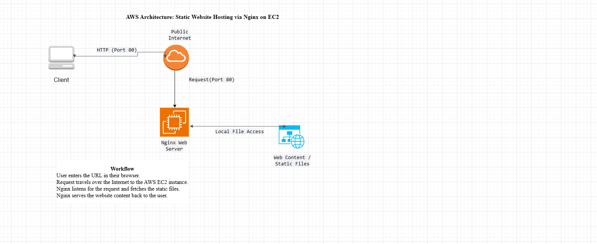
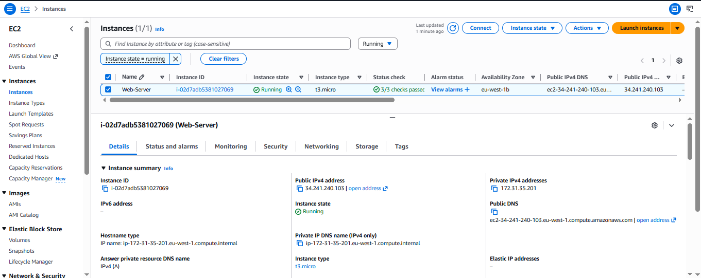
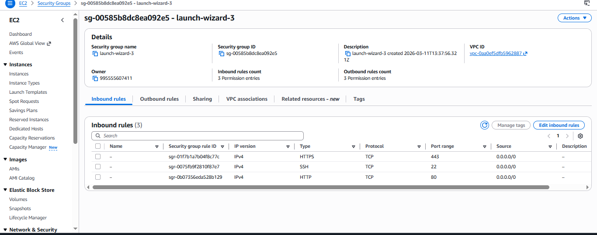

# AWS EC2 Static Website Deployment with Nginx


## Project Overview

This project demonstrates how to deploy a **multi-page static website** on a cloud server using **AWS EC2** and **Nginx**.

The objective of this project is to gain hands-on experience with:

- Cloud infrastructure deployment
- Linux server management
- Web server configuration
- Static website hosting on the cloud

The website consists of multiple HTML pages with CSS styling and JavaScript functionality, hosted on an EC2 instance and served using Nginx.

---

# Architecture



## Architecture Flow

1. User accesses the website through a web browser.
2. The request travels through the public internet.
3. The request reaches the AWS EC2 instance.
4. Nginx processes the request.
5. Nginx serves the static website files to the user.

---

# Website Features

- Multi-page navigation
- Custom CSS styling
- JavaScript functionality
- Organized asset directories
- Static content delivery through a web server
---

# EC2 Instance Running



This screenshot shows the EC2 instance running in the AWS console with the public IP address during deployment.


---

# Security Group Configuration



The EC2 security group is configured to allow the following inbound traffic:

- HTTP (Port 80)
- HTTPS (Port 443)
- SSH (Port 22)

HTTPS and SSH are not required for basic web access but provide additional security and remote server management capability.

---

# Live Website


The website is accessible through the public IP address of the EC2 instance from a user browser.


---

# Deployment Process

## 1. Launch EC2 Instance

- Create an EC2 instance
- Select Amazon Linux AMI
- Generate a key pair for SSH access
- Configure security group rules

---

## 2. Configure Security Group

Open port 80 for HTTP traffic.
Type: HTTP
Protocol: TCP
Port: 80
Source: 0.0.0.0/0

---

## 3. Connect to the Server Using SSH

```bash 
ssh -i Web.pem ec2-user@EC2-PUBLIC-IP
```
---

## 4. Install Nginx

Update the package manager and install the web server.
```bash 
sudo yum update -y
sudo yum install nginx -y
```
---
## 5. Start and Enable Nginx
```bash 
sudo systemctl start nginx
sudo systemctl enable nginx
```
---
## 6. Deploy Website Files

Copy the website files into the Nginx web directory:

```bash 
/usr/share/nginx/html

```
---
## 7. Access the Website

Open the EC2 instance public IP address in a browser:
```bash 
http://EC2-PUBLIC-IP
```
---

## Skills Demonstrated

This project demonstrates practical experience in:

- AWS cloud infrastructure deployment

- Linux server administration

- Web server configuration using Nginx

- Secure server access via SSH

- Static website hosting

- GitHub project documentation

---

## Learning Outcomes

Through this project I learned how to:

- Deploy and manage virtual servers in AWS

- Configure security groups for network access

- Install and configure a production web server

- Host static websites on cloud infrastructure

- Document technical projects professionally on GitHub

---

## Future Improvements

Possible enhancements for this project include:

- Deploying the website using AWS S3 static hosting

- Adding a Load Balancer

- Implementing HTTPS with SSL certificates

- Automating deployment with Infrastructure as Code

- Integrating a CI/CD pipeline

---
## Project Status

✅ Completed

This project was built as part of the **roadmap.sh AWS project series** to practice launching and configuring a cloud server.

Project Reference:  
https://roadmap.sh/projects/ec2-instance


---

## Author

**Mensur**

Information Science Student  
Cloud Computing & DevOps Enthusiast

GitHub: https://github.com/mensurmm.

This project is part of my learning journey in **AWS, Linux server administration, and cloud infrastructure deployment**.
